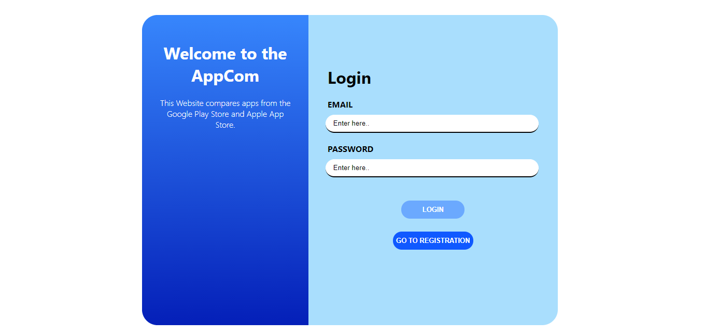
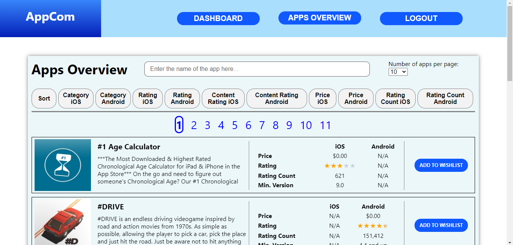
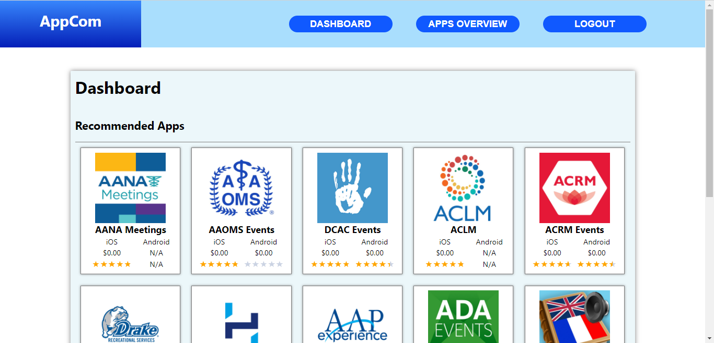
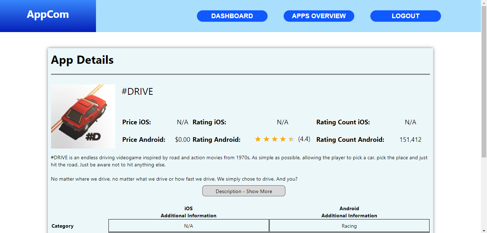

[](https://github.com/ASE-FS21-TrialNError/TrialNError-Client/actions/workflows/deploy.yml)
[](https://sonarcloud.io/dashboard?id=ASE-FS21-TrialNError_TrialNError-Client)

# TrialNError-Client

## General information

This repository is part of the project AppCom and contains the code for the front end of the project. The application
was created using React.js with Javascript. Further information about the 
project can be found in the ["Additional information"](#additionalInformation) section.

The main high level components of this repository are mentioned below:

- **[Login/Registration/EmailVerfication](https://github.com/ASE-FS21-TrialNError/TrialNError-Client/tree/main/src/components)**: 
  Users can register and login to the application.
- **[Apps Overview](https://github.com/ASE-FS21-TrialNError/TrialNError-Client/blob/main/src/components/appOverview/AppsOverview.js)**: 
  Users can filter the apps by name, category, rating, content rating, price, rating count. Furthermore, users can sort 
  the apps and add them to their wish list. By clicking on a particular app, they can see the details of the app in the 
  "App Details" page.

- **[Dashboard](https://github.com/ASE-FS21-TrialNError/TrialNError-Client/blob/main/src/components/dashboard/Dashboard.js)**:
  Users can see their wish list with the added apps and receive recommended apps based on the content of the apps
  in the wish list. In addition, user can remove apps in the wish list.

- **[App Details](https://github.com/ASE-FS21-TrialNError/TrialNError-Client/blob/main/src/components/appDetails/AppDetails.js)**: 
  User can see all the detailed information of a particular app.

**User control flow**: An unregistered user can register on the Registration page. After
the registration the user will be directed to the Email Verification page, where the user should enter the code he received 
by email. (For sending the verification we use Gmail as a SMTP server. Sometimes Gmail fails to send an email due to security reasons, 
in that case we directly authenticate the user and the user will be redirected to login page.) 
After successful verification, the user arrives at the Apps Overview page where he can filter the displayed apps and 
add apps to his wish list. If the user goes to Dashboard page after he added apps to his wish list, he can see these apps in the
wish list in the Dashboard. Based on the apps in the wish list, the user will get a list of recommended above the wish list. 
If a user wants more information for a particular app, he can click on the picture, or the heading of the apps so that he will 
be directed to the App Details page where all the additional information is displayed.

Check out our server repository [:desktop_computer: server repo](https://github.com/ASE-FS21-TrialNError/TrialNError-Server).

Check out our app recommendation repository [:hourglass: python repo ](https://github.com/ASE-FS21-TrialNError/TrialNError-Python).

## Demo
Click [here](https://appcom-trailnerror.herokuapp.com/) for Live demo

## Launch & Deployment - for joining developers

To run the application locally, a Node.js version >= 12.10 will be needed. Node.js can be downloaded [here](https://nodejs.org).

```bash
npm install
```

This command has to be run before starting the application for the first time. It will install further dependencies besides Node.js.

```bash
npm run dev
```

This command runs the application in the development mode.
Open [http://localhost:4000](http://localhost:4000) to view it in the browser.
The development mode runs with hot compile if make any changes in the code it will update in real time. 

```bash
npm run test
```

This command starts the test runner. 
More information can be found [here](https://facebook.github.io/create-react-app/docs/running-tests).

```bash
npm run build
```

This commands builds the application to the `build` folder. The application is correctly bundled and optimized for production.

For further information have a look at the section [deployment](https://facebook.github.io/create-react-app/docs/deployment).

## CI/CD pipeline

For information regarding the setup of the CI/CD pipeline of the Client repo, please refer to the specific Project Wiki [page](https://github.com/ASE-FS21-TrialNError/TrialNError-Client/wiki/CI-CD-pipeline).

## Illustrations of the Front end 

This application consists mainly out of four parts. For each of these parts you can find a picture below.

### Login
A user can get access to the AppCom service by providing user credentials.


### Apps Overview
In the Apps Overview page a user can sort and filter the apps. Furthermore, he can add them to his wish list.


### Dashboard
A user can see all the apps he added to his wish list below the recommended apps. As soon as a user adds an app to the
wish list, he receives recommendations for other apps based on the content and rating of the apps in his wish list.


### App Details
A user can get additional information on each app on the App Details page.


## Roadmap
Joining developers can contribute to the project by adding the following things:

- User can have several wish lists
- Providing the user with an overview with charts of what kind of apps he has in his whish list, example: pie chart 
  with how many apps are for iOS, Android and both systems.
- ... any other creative extensions which increases user experience! :smile:

## Additional information (not specific to this repository)<a name="additionalInformation"></a>

For additional information please refer to the Project Wiki:

- [Overall project idea & motivation](https://github.com/ASE-FS21-TrialNError/TrialNError-Client/wiki/Introduction-(Project-idea-&-Motivation))
- [Data sources](https://github.com/ASE-FS21-TrialNError/TrialNError-Client/wiki/Data-selection)
- [Architecture & Technologies](https://github.com/ASE-FS21-TrialNError/TrialNError-Client/wiki/Architecture-&-Technologies)
- [MongoDB Data model](https://github.com/ASE-FS21-TrialNError/TrialNError-Client/wiki/MongoDB-Data-model)
- [Project documentation](https://github.com/ASE-FS21-TrialNError/TrialNError-Client/wiki/Documentation)
- [Recommender system](https://github.com/ASE-FS21-TrialNError/TrialNError-Client/wiki/Recommender-system)
- [Limitations & workarounds](https://github.com/ASE-FS21-TrialNError/TrialNError-Client/wiki/Limitations-&-workarounds)
- [Project plan](https://github.com/ASE-FS21-TrialNError/TrialNError-Client/wiki/Project-plan)
- [Roles & Task management](https://github.com/ASE-FS21-TrialNError/TrialNError-Client/wiki/Roles-&-Tasks-management)
- [Branch management](https://github.com/ASE-FS21-TrialNError/TrialNError-Client/wiki/Branch-management-&-Handling-of-Pull-requests)

## Authors and acknowledgment

We thank the ASE team FS21 for all the support and advice during this course.
We also acknowlege the Sopra team FS21 as we used the client template.

### Authors

- [Tanzil](https://github.com/tanzilkm)
- [Vladimir](https://github.com/vldonkov)
- [Lukas](https://github.com/LukZeh)

